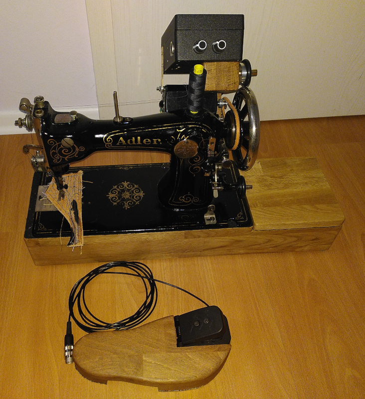

# Bigfoot
Bigfoot is a sewing machine motor speed control made to truly control the speed rather than merely regulating the power.

|Bigfoot and an Adler class 8 sewing machine|
|------------------------------------------|
||

It uses feedback through a tachometer and a PID controller to maintain the speed set by the foot pedal.  A sewing machine with a Bigfoot controller can steadily work its way through thick stacked leather - provided you are using a solid old vintage sewing machine.

[More details of the background and development of Bigfoot can be found in this series of posts on my blog.](https://josepheoff.github.io/posts/motorcontrol-toc)

Here's Bigfoot and the Adler working through eight, then two, then four layers of fake leather while maintaining a steady speed:

https://github.com/JosephEoff/Bigfoot/assets/13119635/e1ab42f6-7f08-4af5-ab49-b018099e2578

